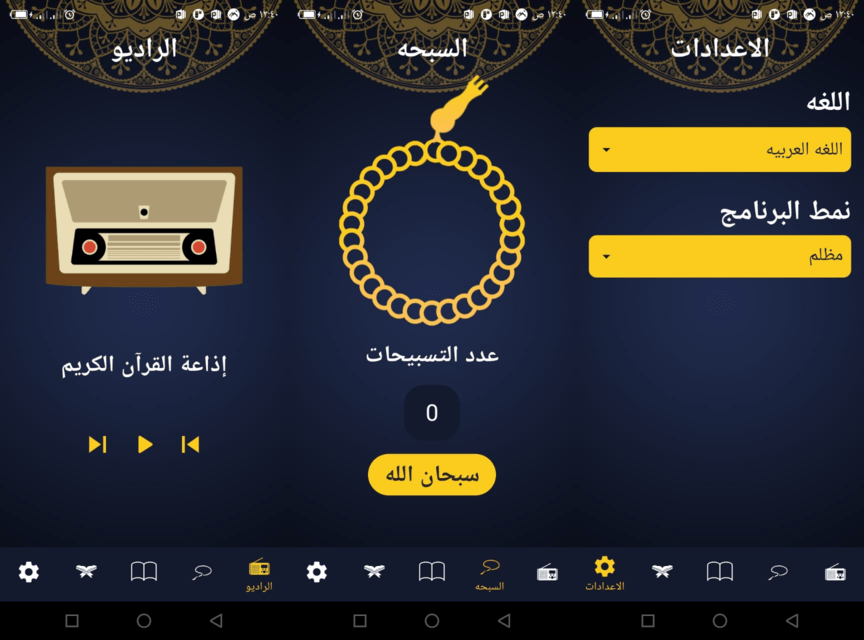
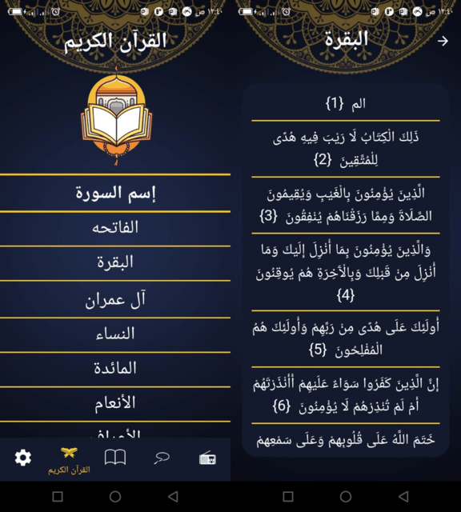
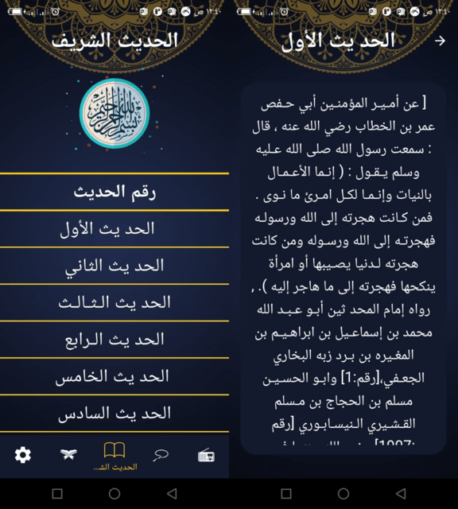

# Islami Application

This is the first project from The Flutter Diploma i'm currently taking with [Route Academy](https://www.facebook.com/Routelearning)

### Things I learned from this project
1. Loading Text File
2. new Widgets
3. Resolution aware image assets (2x and 3x images)
4. State Management (Provider Package)
5. Localization
6. Themeing
7. How to implement Light an Dark Mode
8. Structuring the app for more cleaner code
9. Using SharedPreferences  with Provider to store changes.

#### Screens

-------

-------

